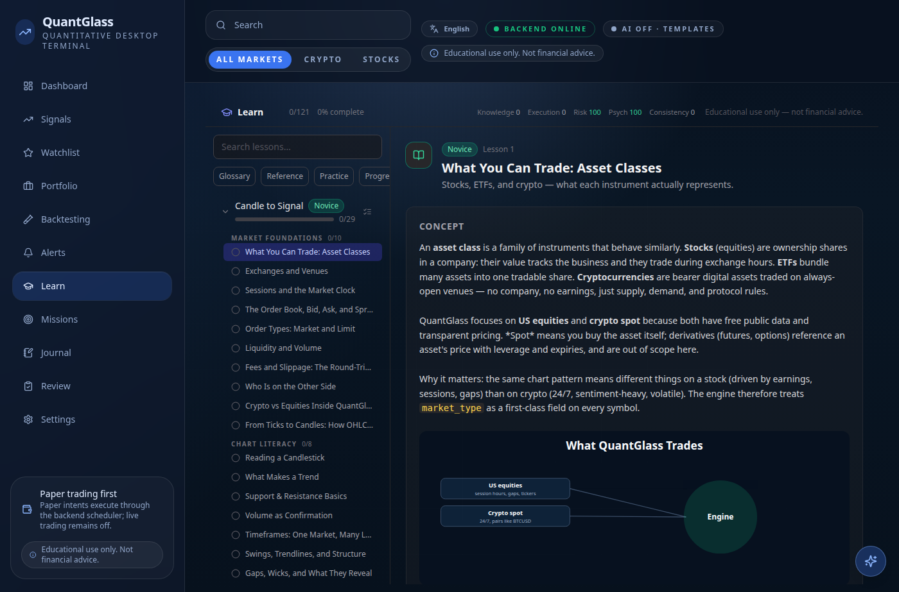
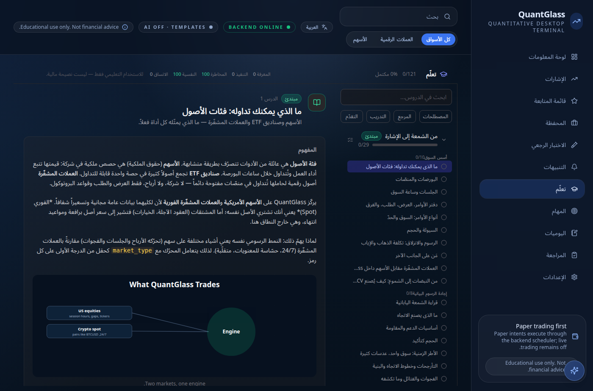

# Content packs: lessons, missions, and localization

QuantGlass content packs let you ship **curriculum as data**. A lesson pack is one
track of declarative lessons; a mission pack is a set of behavioral challenges
scored against the user's own activity. Both are validated whole at registration
and rendered through the same vetted components as the built-in Academy — a pack
can never inject markup or run code in the UI.

> Prerequisite: [Getting Started](getting-started.md) (manifest, `register`,
> testing in isolation).

---

## Authoring a lesson pack

A `LessonPackDefinition` is an id, title, description, level, and a tuple of
declarative lesson dicts. Each lesson carries markdown `concept`, `key_terms`, and
a multiple-choice `exercise`.

```python
from quantglass_sdk import ExtensionManifest, LessonPackDefinition

_LESSONS = (
    {
        "id": "vwap-basics",
        "title": "VWAP: The Session Benchmark",
        "summary": "Why institutions measure fills against the volume-weighted average price.",
        "concept": (
            "**VWAP** answers one question: what did the average participant pay this "
            "session? Each trade contributes its price weighted by its size.\n\n"
            "Institutions benchmark executions against it — a buyer filling below VWAP "
            "beat the session's average."
        ),
        "key_terms": [
            {"term": "Session anchor", "definition": "The session-open point VWAP accumulates from."},
        ],
        "exercise": {
            "type": "multiple_choice",
            "question": "Price has traded below VWAP all session. Who is in control?",
            "options": [
                "Buyers — the dip is a discount",
                "Sellers — the average long is underwater",
                "Nobody — VWAP says nothing about control",
            ],
            "correct_index": 1,
            "explanation": "Sustained trade below VWAP means the average long is losing.",
        },
    },
    # …more lessons…
)

PACK = LessonPackDefinition(
    id="community-vwap",
    title="VWAP, end to end",
    description="A short community track on the session benchmark.",
    level="intermediate",
    lessons=_LESSONS,
    source_extension="my-extension",
    attribution="Authored by the community.",
)
```

Register it from your extension's `register()`:

```python
def register(self, context):
    context.register_lesson_pack(PACK)
```

`register_lesson_pack` **validates the whole pack** and reports any rejected lesson
in `context.diagnostics` (it never raises) — so a malformed exercise disables that
lesson, not your extension.

---

## Authoring a mission pack

Missions are **declarative criteria only** — the engine evaluates them against the
learner's real activity, so a pack can never execute code. Each mission is an id,
title, level, category, description, and a list of `criteria` drawn from the
engine's criteria vocabulary.

```python
from quantglass_sdk import MissionPackDefinition

PACK = MissionPackDefinition(
    id="community-challenges",
    title="Community Challenges",
    description="Starter behavioral challenges.",
    missions=(
        {
            "id": "clean-dozen",
            "title": "The Clean Dozen",
            "level": "intermediate",
            "category": "community-challenges",
            "description": "Twelve trades, every one stopped, journaled, and inside risk policy.",
            "criteria": [
                {"type": "min_trades", "label": "Execute 12 trades", "value": 12},
                {"type": "all_have_stops", "label": "Every trade has a stop"},
                {"type": "max_risk_percent_each", "label": "Zero risk breaches"},
                {"type": "min_journaled", "label": "Journal 12 trades", "value": 12},
            ],
        },
    ),
    source_extension="my-extension",
)
```

The criteria `type` vocabulary (`min_trades`, `min_lessons_completed`,
`all_have_stops`, `max_risk_percent_each`, `min_review_reps`, …) is defined by the
host in `app.services.missions.CRITERIA_TYPES`. Copy
[`packs/community_mission_pack_example.py`](../../packs/community_mission_pack_example.py)
and design from there.

---

## Localization — the honest state

This is the question every author asks now that QuantGlass ships in 20 languages,
so here is the precise picture.

**The built-in Academy is fully localized** — its 121 lessons render in 20
languages (with right-to-left Arabic, Persian, Urdu, and Sindhi) via an
**app-level locale overlay** (`content/lessons/<locale>/…` files, merged
field-by-field over the English source, with answer keys and ids kept identical so
grading stays locale-independent):

<table>
<tr>
<td></td>
<td></td>
</tr>
<tr><td align="center"><sub>Built-in catalog — English</sub></td><td align="center"><sub>…and Arabic, layout fully mirrored</sub></td></tr>
</table>

**Extension packs do not plug into that overlay yet.** The SDK's
`LessonPackDefinition` / `MissionPackDefinition` carry a single set of prose
fields — there is **no per-locale field or pack-localization API in the SDK
today**. A pack renders in the language you authored it in.

So, practically:

- **Author in your audience's language.** A pack written in Urdu renders in Urdu
  (the surrounding app chrome already follows the user's selected language). For an
  emerging-market audience this is often exactly what you want.
- **Ship one pack per language** if you need several — distinct `id`s
  (`community-vwap-en`, `community-vwap-ur`), same lessons translated. It's a
  workaround, not elegance.
- **Keep numbers, tickers, and indicator names verbatim** across any translation,
  exactly as the core catalog does — the math should read the same everywhere.

> **Roadmap:** first-class per-locale content packs (so one pack carries all its
> languages and joins the overlay) is tracked under the
> [`i18n`](https://github.com/quantglass-labs/quantglass/labels/i18n) label. If
> that's something you'd build or use, that issue is the place to say so.

---

## Test it in isolation

```python
from dataclasses import dataclass, field
from quantglass_sdk import ExtensionContext
from my_pack.extension import MyPackExtension  # registers PACK


@dataclass
class Recording:
    items: list = field(default_factory=list)
    def register(self, definition=None, /, *a, **k):
        self.items.append(definition)
        return []  # a pack registry returns a list of validation problems


def test_pack_registers_clean():
    packs = Recording()
    ctx = ExtensionContext(provider_manager=Recording(), lesson_pack_registry=packs)
    MyPackExtension().register(ctx)
    assert any(p.id == "community-vwap" for p in packs.items)
    # no rejection diagnostics means every lesson validated
    assert not any("rejected" in d for d in ctx.diagnostics)
```

> Educational and research tooling. Nothing here is financial advice.
