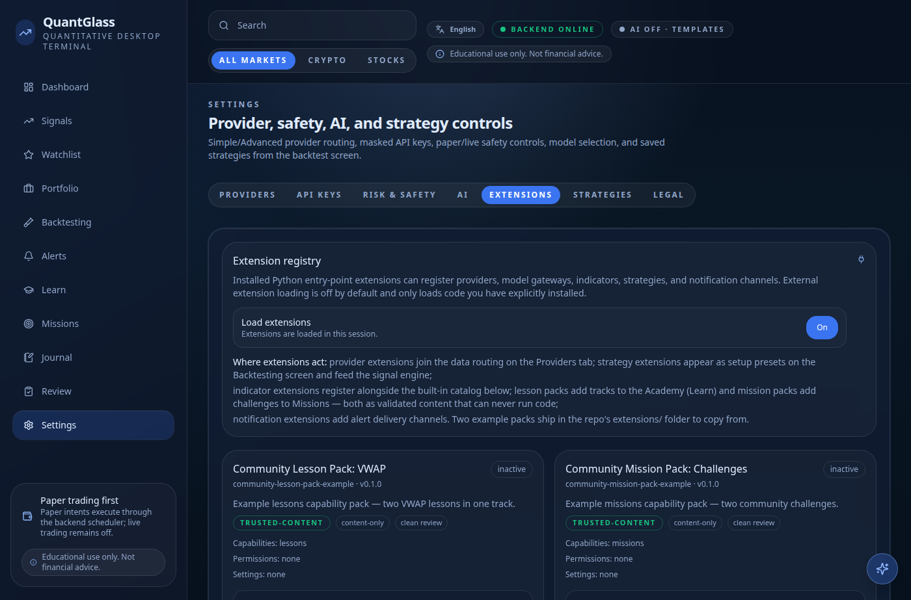
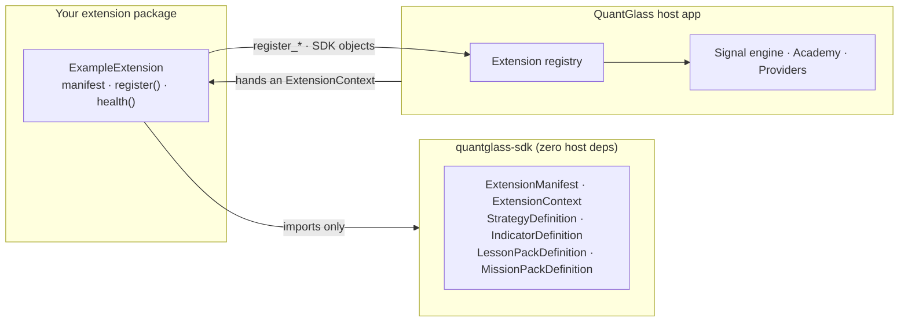
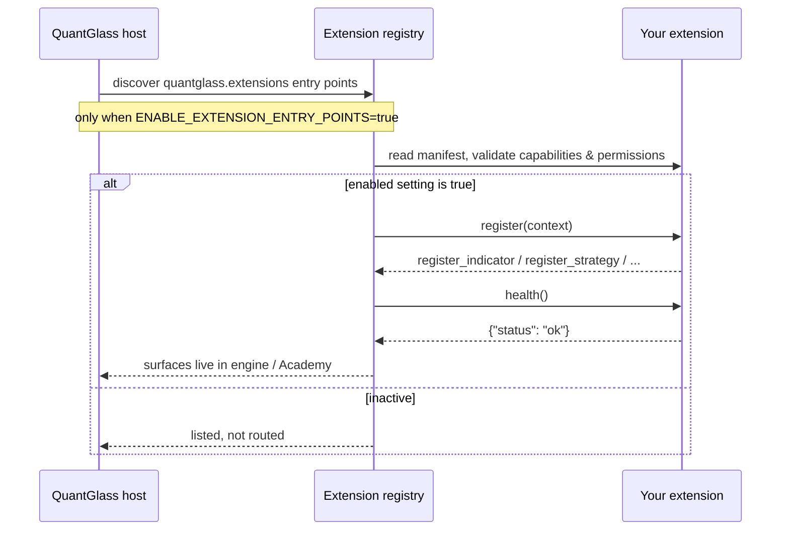

# Getting Started: your first QuantGlass extension

This guide takes you from an empty folder to a working extension that the
QuantGlass app discovers, loads, and lists in its **Extension registry** — in
about ten minutes. No trading expertise required, and you never import the host
application: you build against the standalone [`quantglass-sdk`](https://github.com/quantglass-labs/quantglass-sdk)
and unit-test it in isolation.

By the end you will have registered a provider, an indicator, and a strategy, and
seen them appear in the app:



---

## How extensions fit together

An extension is ordinary Python that imports **only** the SDK. The host app hands
it an `ExtensionContext` at load time; the extension calls `register_*(...)` on
that context with SDK definition objects. It never reaches into the app, and the
app never imports your package's internals — the SDK is the entire contract
surface between you.



That boundary is what lets you develop and test an extension without running the
app at all.

---

## Prerequisites

- Python 3.12+
- The SDK (until it is published to PyPI, install from the repository):

```bash
python -m venv .venv && source .venv/bin/activate
pip install "quantglass-sdk @ git+https://github.com/quantglass-labs/quantglass-sdk.git"
python -c "from quantglass_sdk import ExtensionManifest, StrategyDefinition; print('SDK ready')"
```

---

## Step 1 — Scaffold the package

An extension is a normal Python distribution that exposes one entry point in the
`quantglass.extensions` group. Minimal layout:

```text
my-quantglass-extension/
├── pyproject.toml
└── my_extension/
    ├── __init__.py
    └── extension.py
```

```toml
# pyproject.toml
[project]
name = "my-quantglass-extension"
version = "0.1.0"
dependencies = ["quantglass-sdk"]

[project.entry-points."quantglass.extensions"]
my-extension = "my_extension.extension:MyExtension"
```

The entry-point value is `module_path:ClassName` — this is how the host discovers
your extension without you editing the core app.

---

## Step 2 — Implement the extension

An extension is a class with three things: a `manifest` (identity, capabilities,
permissions, settings), a `register(context)` method (where you add your
surfaces), and a `health()` method.

```python
# my_extension/extension.py
from quantglass_sdk import (
    ExtensionContext,
    ExtensionManifest,
    ExtensionSetting,
    IndicatorDefinition,
    StrategyDefinition,
)


class MyExtension:
    manifest = ExtensionManifest(
        id="my-extension",
        name="My Extension",
        version="0.1.0",
        description="Registers a demo indicator and strategy.",
        capabilities=("indicator", "strategy"),
        permissions=("read_market_data",),
        settings=(
            ExtensionSetting(
                key="enabled",
                label="Enabled",
                type="boolean",
                description="Whether this extension participates in registry routing.",
                default=False,
            ),
        ),
        homepage="https://github.com/quantglass-labs/quantglass-extensions",
    )

    def register(self, context: ExtensionContext) -> None:
        context.register_indicator(
            IndicatorDefinition(
                id="my-liquidity-score",
                name="My Liquidity Score",
                category="liquidity",
                description="Demo indicator for the getting-started guide.",
                inputs=("close", "volume"),
                outputs=("liquidity_score",),
                source="extension",
                extension_id=self.manifest.id,
            )
        )
        context.register_strategy(
            StrategyDefinition(
                id="my-liquidity-pullback",
                name="My Liquidity Pullback",
                description="Demo strategy for the getting-started guide.",
                setup_types=("my_liquidity_pullback",),
                direction="long",
                source="extension",
                extension_id=self.manifest.id,
            )
        )
        context.diagnostics.append("my-extension registered 1 indicator and 1 strategy.")

    def health(self) -> dict[str, object]:
        return {"status": "ok", "loaded": True}
```

> `capabilities` and `permissions` are declarations the host enforces — request
> only what you use. See [Packaging, permissions & trust](packaging-and-trust.md).

---

## Step 3 — Test it in isolation

Because the extension imports only the SDK, you can exercise it with no host app
and no network. `ExtensionContext` routes each `register_*` call to a host
registry; for a test, hand it tiny **recording** doubles and assert on what your
extension registered.

```python
# tests/test_my_extension.py
from dataclasses import dataclass, field

from quantglass_sdk import ExtensionContext
from my_extension.extension import MyExtension


@dataclass
class Recording:
    """Minimal test double: captures whatever the extension registers."""

    items: list = field(default_factory=list)

    def register(self, definition=None, /, *args, **kwargs):
        self.items.append(definition)
        return []  # lesson/mission registries return a list of problems


def test_registers_indicator_and_strategy():
    indicators, strategies = Recording(), Recording()
    ctx = ExtensionContext(
        provider_manager=Recording(),  # required by the contract; unused here
        indicator_registry=indicators,
        strategy_registry=strategies,
    )

    ext = MyExtension()
    ext.register(ctx)

    assert ext.health()["status"] == "ok"
    assert any(d.id == "my-liquidity-score" for d in indicators.items)
    assert any(d.id == "my-liquidity-pullback" for d in strategies.items)
```

```bash
pip install -e . && pip install pytest
pytest -q
```

This is the loop you live in: edit, `pytest`, repeat — entirely offline. (When a
registry is left unset, `register_*` records the reason in `context.diagnostics`
instead of raising — handy for asserting graceful behavior too.)

---

## Step 4 — Load it in the app

Loading external extension code runs Python inside the backend, so QuantGlass
keeps it **disabled by default**. Two gates must be open:

1. **Discovery** — start the backend with entry-point discovery on:

   ```bash
   QUANTGLASS_ENABLE_EXTENSION_ENTRY_POINTS=true npm run backend:dev:extensions
   ```

2. **Activation** — each discovered extension stays *inactive* until its persisted
   `enabled` setting is `true`. Flip it from **Settings → Extensions**, or via the
   API, then restart the backend (third-party Python is imported at startup):

   ```bash
   curl -X PUT http://127.0.0.1:8000/api/extensions/registry/my-extension/enabled \
        -H "Content-Type: application/json" -d '{"enabled": true}'
   ```



You can confirm the load from the registry endpoints:

```text
GET /api/extensions/registry
GET /api/extensions/registry/my-extension
GET /api/extensions/registry/my-extension/health
```

…and visually, in **Settings → Extensions**, where your extension now appears in
the registry alongside its capabilities and trust label (the same screen shown at
the top of this guide).

---

## Where to go next

Each surface has a reference contract today; step-by-step guides (in this same
illustrated style) are being added on top of them:

| Build a… | Reference contract |
| --- | --- |
| Market-data / news / broker adapter | [Provider adapters](../provider-adapters.md) |
| Strategy / signal plugin | [Strategy & signal plugins](../strategy-plugins.md) |
| Deterministic indicator | [Indicator contract](../indicator-contract.md) |
| The full authoring model & vocabulary | [Extensions](../extensions.md) · [Extension types](../extension-types.md) |

The full symbol surface lives in the
[`quantglass-sdk`](https://github.com/quantglass-labs/quantglass-sdk) README.

> **Coming next in this series:** _Content packs & localization_ — how to author a
> lesson or mission pack and ship it in any of QuantGlass's 20 languages — and
> _Packaging, permissions & trust_.

> Educational and research tooling. Nothing here is financial advice.
