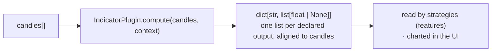

# Build an indicator

An indicator turns candles into one or more named output series that strategies and
the UI can read. The contract is deliberately strict: indicators are
**deterministic** — the same candles always produce the same numbers — so they can
be fixture-tested and trusted inside a backtest.

> Prerequisite: [Getting Started](getting-started.md).

---

## The contract



`IndicatorDefinition` declares the surface; `IndicatorPlugin.compute` produces the
series. Each output list is **aligned to the candles** (same length), with `None`
in the warm-up region where the value isn't defined yet.

```python
from quantglass_sdk import (
    ExtensionContext, ExtensionManifest, IndicatorDefinition,
)


class LiquidityScoreExtension:
    manifest = ExtensionManifest(
        id="acme-liquidity",
        name="Acme Liquidity Score",
        version="0.1.0",
        description="A volume-normalized liquidity score.",
        capabilities=("indicator",),
        permissions=("read_market_data",),
    )

    def register(self, context: ExtensionContext) -> None:
        context.register_indicator(
            IndicatorDefinition(
                id="acme-liquidity-score",
                name="Liquidity Score",
                category="liquidity",
                description="Close-to-volume liquidity pressure, 0–100.",
                inputs=("close", "volume"),
                outputs=("liquidity_score",),
                maturity="computed",          # 'computed' = has a compute(); 'catalog' = declared only
                families=("liquidity", "volume"),
                source="extension",
                extension_id=self.manifest.id,
            )
        )

    def compute(self, candles, context) -> dict[str, list[float | None]]:
        period = int(context.get("period", 20))
        vols = [c["volume"] for c in candles]
        out: list[float | None] = []
        for i in range(len(candles)):
            if i + 1 < period:
                out.append(None)                      # warm-up: undefined
            else:
                window = vols[i + 1 - period : i + 1]
                avg = sum(window) / period
                out.append(min(100.0, 100.0 * vols[i] / avg) if avg else 0.0)
        return {"liquidity_score": out}

    def health(self) -> dict[str, object]:
        return {"status": "ok", "loaded": True}
```

Rules that keep an indicator trustworthy:

- **Deterministic.** No clocks, no randomness, no network — outputs are a pure
  function of the candles (and `context` parameters).
- **Aligned & honest about warm-up.** Return one value per candle; use `None` where
  the value isn't defined yet rather than back-filling a fake number.
- **`inputs`/`outputs` are the contract.** Declare exactly the candle fields you
  read and the series you emit.

---

## Test it with a fixture

Determinism makes indicators the easiest surface to test — pin a small candle
fixture and assert exact outputs.

```python
def test_liquidity_score_is_deterministic_and_aligned():
    ext = LiquidityScoreExtension()
    candles = [{"close": 10.0, "volume": v} for v in (100, 100, 300)]
    out = ext.compute(candles, {"period": 2})["liquidity_score"]

    assert len(out) == len(candles)   # aligned
    assert out[0] is None             # warm-up
    assert out[2] == 150.0 and out[2] == ext.compute(candles, {"period": 2})["liquidity_score"][2]
```

---

## Reference & next

- Contract details: [docs/indicator-contract.md](../indicator-contract.md).
- Related: [strategy plugins](strategy-plugin.md) (consume your outputs as features)
  · [packaging & trust](packaging-and-trust.md).

> Educational and research tooling. Nothing here is financial advice.
