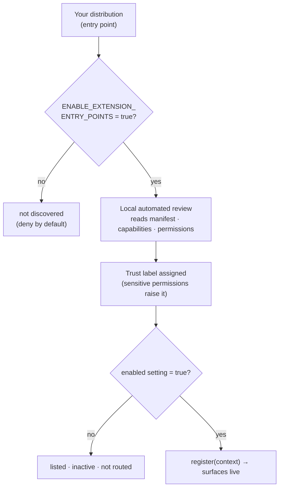

# Packaging, permissions & trust

This guide covers the last mile: declaring what your extension is allowed to do,
packaging it as a discoverable distribution, and how QuantGlass decides how much to
trust it. Loading extension code runs Python inside the backend, so the model is
**deny-by-default and least-privilege** throughout.

> Prerequisite: [Getting Started](getting-started.md).


---

## The manifest is the contract

Everything the host knows about your extension before it loads comes from the
`ExtensionManifest`: identity, the **capabilities** it provides, the **permissions**
it needs, and its **settings**.

### Capabilities — what the extension provides

| | |
| --- | --- |
| `market_data` · `news` | Data adapters |
| `trading` · `execution` | Order routing / paper or broker execution |
| `strategy` · `indicator` · `backtest` · `data_quality` | Engine surfaces |
| `ai_model` | An AI gateway/provider |
| `notification` | Alert channels |
| `lessons` · `missions` | Academy content packs |
| `import_export` · `ui_panel` | Data movement / a UI surface |

### Permissions — what the host must grant

| Permission | Grants | Scrutiny |
| --- | --- | --- |
| `read_market_data` | Read engine market data | low |
| `write_state` | Persist extension state | low |
| `render_ui` | Contribute a UI panel | low |
| `run_model` | Invoke a configured model | medium |
| `network_access` | Reach the network (any `public`/`keyed` provider) | medium |
| `read_secrets` | Read stored credentials | **high** |
| `submit_orders` | Place orders (any `trading` capability) | **high** |

The host **enforces** these at registration: a provider on a `public`/`keyed`
transport without `network_access`, or a `trading` capability without
`submit_orders`, is skipped with a diagnostic (see
[Provider adapters](provider-adapter.md)). **Declare only what you use** — unused
sensitive permissions cost you trust for no benefit.

### Settings — typed, user-editable configuration

`ExtensionSetting(key, label, type, …)` where `type` is one of `string`, `number`,
`boolean`, `select` (with `options`), or `secret` (masked, stored in the keychain
when available). These render in **Settings → Extensions**.

---

## Package it for discovery

An extension is a normal Python distribution exposing one `quantglass.extensions`
entry point:

```toml
# pyproject.toml
[project]
name = "my-quantglass-extension"
version = "0.1.0"
dependencies = ["quantglass-sdk"]

[project.entry-points."quantglass.extensions"]
my-extension = "my_extension.extension:MyExtension"
```

Local development files under an `extensions/*.py` directory are also discovered —
handy before you publish a package.

---

## Load, trust, and enable



1. **Discovery** is opt-in:

   ```bash
   QUANTGLASS_ENABLE_EXTENSION_ENTRY_POINTS=true npm run backend:dev:extensions
   ```

2. **A local automated review** runs at discovery and assigns a **trust label** from
   the capabilities and permissions you declare — `submit_orders`, `read_secrets`,
   and `network_access` carry the most weight. The label is shown next to your
   extension in **Settings → Extensions** (above), so users see what they're
   enabling.

3. **Activation** is explicit and per-extension — each stays inactive until its
   `enabled` setting is `true`, and toggling it requires a backend restart because
   third-party Python is imported at startup:

   ```bash
   curl -X PUT http://127.0.0.1:8000/api/extensions/registry/my-extension/enabled \
        -H "Content-Type: application/json" -d '{"enabled": true}'
   ```

### Inspecting the registry

```text
GET /api/extensions/registry                      # all discovered extensions + labels
GET /api/extensions/registry/{id}                 # one extension
GET /api/extensions/registry/{id}/health          # your health() output
GET /api/extensions/registry/{id}/settings        # current settings
PUT /api/extensions/registry/{id}/settings        # update settings
PUT /api/extensions/registry/{id}/enabled         # activate / deactivate
```

---

## Trust checklist before you publish

- [ ] Declare the **minimum** capabilities and permissions; drop anything unused.
- [ ] No secrets in code or logs; read credentials via a `secret` setting, never a
      hard-coded constant.
- [ ] `health()` returns quickly and honestly.
- [ ] Content packs validate clean (no rejected lessons/missions in diagnostics).
- [ ] Provider output passes `validate_candles`.
- [ ] Tests run with no host and no network (see each surface guide).

---

## Reference & next

- The authoring model and full vocabulary: [docs/extensions.md](../extensions.md)
  · [docs/extension-types.md](../extension-types.md).
- Surface guides: [providers](provider-adapter.md) · [strategies](strategy-plugin.md)
  · [indicators](indicator.md) · [content packs & localization](content-packs-localization.md).

> Educational and research tooling. Nothing here is financial advice.
