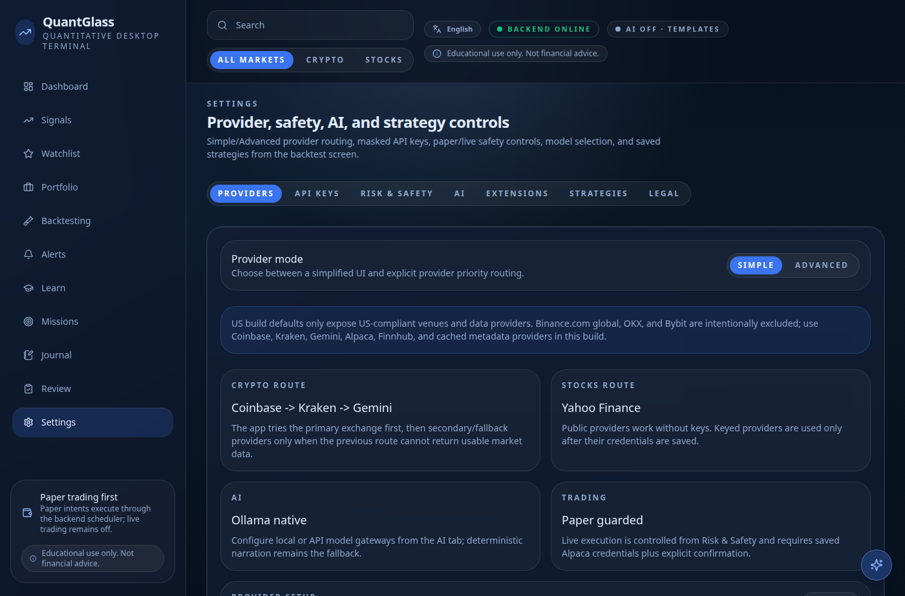
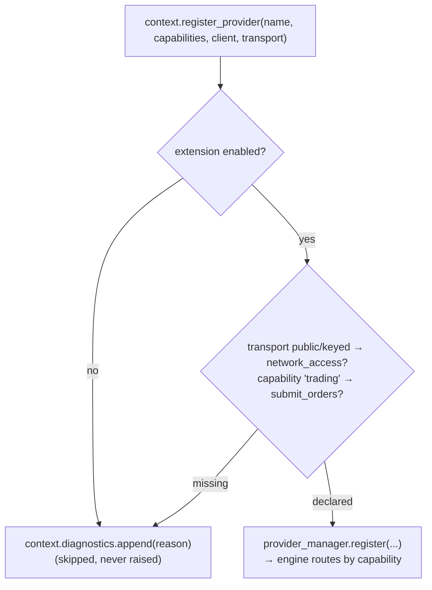

# Build a provider adapter

A provider adapter feeds QuantGlass external data or execution — market candles,
an order book, news, a paper/broker endpoint, or an AI gateway. You declare a
**capability** and a **transport**, the host enforces the matching **permission**,
and your adapter is wired into the engine.

> Prerequisite: [Getting Started](getting-started.md).



---

## The capability / transport / permission model

Registration runs through three gates the host enforces for you:



- **`capabilities: set[Capability]`** — what the adapter provides. Vocabulary:
  `"ohlcv"`, `"order_book"`, `"news"`, `"trading"`, `"ai"`.
- **`transport`** — `"public"` (keyless public API), `"keyed"` (needs a credential),
  or `"internal"` (in-process, no network).
- **Permissions are declared in the manifest and enforced at registration:** a
  `public`/`keyed` transport requires `network_access`; a `"trading"` capability
  requires `submit_orders`. Miss one and the registration is *skipped with a
  diagnostic* — it never raises.

> Request only what you use. Declaring `submit_orders` is what moves an extension
> into the manual-review trust tier — see [Packaging, permissions & trust](packaging-and-trust.md).

---

## Implement it

```python
from quantglass_sdk import (
    ExtensionContext, ExtensionManifest, ExtensionSetting,
)


class MarketDataExtension:
    manifest = ExtensionManifest(
        id="acme-market-data",
        name="Acme Market Data",
        version="0.1.0",
        description="Public OHLCV adapter for Acme's candles API.",
        capabilities=("market_data",),
        permissions=("network_access", "read_market_data"),
        settings=(
            ExtensionSetting(key="enabled", label="Enabled", type="boolean", default=False),
            ExtensionSetting(key="base_url", label="Base URL", type="string", required=False),
        ),
        homepage="https://github.com/quantglass-labs/quantglass-extensions",
    )

    def register(self, context: ExtensionContext) -> None:
        context.register_provider(
            name="acme_ohlcv",
            capabilities={"ohlcv"},
            client=AcmeClient(),     # your adapter object (see below)
            transport="public",      # requires the declared network_access permission
        )
        context.diagnostics.append("acme_ohlcv registered as a public OHLCV adapter.")

    def health(self) -> dict[str, object]:
        return {"status": "ok", "loaded": True}
```

### Returning candles the engine trusts

Whatever your `client` returns for OHLCV must match the canonical candle shape, or
the engine rejects it. Validate before you hand it over — the SDK ships the same
checker the host uses:

```python
from quantglass_sdk import validate_candles  # REQUIRED_CANDLE_FIELDS enforced

problems = validate_candles(candles)   # [] means clean
# required per candle: open_time_utc, open, high, low, close, volume
# also checks: monotonic, de-duplicated open times; numeric OHLCV
```

A provider that returns malformed or out-of-order candles is caught here rather
than corrupting a backtest downstream.

---

## Test it in isolation

```python
from dataclasses import dataclass, field
from quantglass_sdk import ExtensionContext
from acme.extension import MarketDataExtension


@dataclass
class FakeProviderManager:
    registered: list = field(default_factory=list)
    def register(self, **kwargs):
        self.registered.append(kwargs)


def test_registers_public_ohlcv_with_permission():
    pm = FakeProviderManager()
    ctx = ExtensionContext(
        provider_manager=pm,
        permissions=("network_access", "read_market_data"),  # what the manifest declares
    )
    MarketDataExtension().register(ctx)
    assert pm.registered and pm.registered[0]["name"] == "acme_ohlcv"
    assert "ohlcv" in pm.registered[0]["capabilities"]


def test_public_transport_without_permission_is_skipped():
    ctx = ExtensionContext(provider_manager=FakeProviderManager(), permissions=())
    MarketDataExtension().register(ctx)
    # no network_access declared → registration skipped with a diagnostic, not an error
    assert any("network_access" in d for d in ctx.diagnostics)
```

That second test is the important one: it proves the permission gate, with no
network and no host.

---

## Reference & next

- Contract details and the registrar protocol: [docs/provider-adapters.md](../provider-adapters.md).
- Other surfaces: [strategy plugins](strategy-plugin.md) · [indicators](indicator.md) · [packaging & trust](packaging-and-trust.md).

> Educational and research tooling. Nothing here is financial advice.
