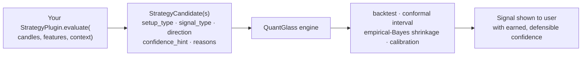

# Build a strategy / signal plugin

A strategy contributes **setups** — named conditions that, when met, produce signal
**candidates**. What you do *not* do is assert a confidence number: you hand the
engine candidates, and the engine earns the confidence through its own honest
backtest, conformal, and calibration machinery. That separation is the whole point
— a strategy can't flatter itself.

> Prerequisite: [Getting Started](getting-started.md).

---

## How a candidate becomes a shown signal



Your `confidence_hint` is a *hint* — an input to the engine's evaluation, not the
number the user sees. The engine can and will down-rank a setup whose backtest does
not support it.

---

## 1. Declare the strategy

`StrategyDefinition` registers the setup so it appears in the catalog and can be
filtered. Provide a `candidate_factory` to make it executable (its presence flips
`executable` to `true`).

```python
from quantglass_sdk import ExtensionContext, ExtensionManifest, StrategyDefinition


class VwapReversionExtension:
    manifest = ExtensionManifest(
        id="acme-vwap-reversion",
        name="Acme VWAP Reversion",
        version="0.1.0",
        description="A ranging-regime fade back to session VWAP.",
        capabilities=("strategy",),
        permissions=("read_market_data",),
    )

    def register(self, context: ExtensionContext) -> None:
        context.register_strategy(
            StrategyDefinition(
                id="acme-vwap-reversion",
                name="VWAP Reversion",
                description="Fade a stretch from VWAP in ranging regimes.",
                setup_types=("vwap_reversion_long", "vwap_reversion_short"),
                direction="both",
                market_types=("crypto", "stocks"),
                timeframes=("15m", "1h"),
                source="extension",
                extension_id=self.manifest.id,
                candidate_factory=self.evaluate,  # makes it executable
            )
        )

    def health(self) -> dict[str, object]:
        return {"status": "ok", "loaded": True}
```

## 2. Produce candidates

The executable side implements the `StrategyPlugin` contract — `evaluate` receives
the candles, precomputed `features`, and a `context`, and returns candidates:

```python
from quantglass_sdk import StrategyCandidate

    def evaluate(self, candles, features, context) -> list[StrategyCandidate]:
        vwap = features.get("vwap", [])
        close = [c["close"] for c in candles]
        if not vwap or context.get("regime") != "ranging":
            return []  # the regime gate: mean-reversion needs a ranging regime

        stretch = (close[-1] - vwap[-1]) / vwap[-1]
        if stretch < -0.015:  # stretched below VWAP → fade long
            return [
                StrategyCandidate(
                    setup_type="vwap_reversion_long",
                    signal_type="BUY_ZONE",
                    direction="long",
                    confidence_hint=0.55,  # a hint; the engine decides what's shown
                    reasons=(
                        f"Price {stretch:.1%} below session VWAP in a ranging regime.",
                        "Mean-reversion read; invalidated if the session turns trending.",
                    ),
                    metadata={"stretch": stretch},
                )
            ]
        return []
```

> `signal_type` is one of `BUY_ZONE`, `SELL`, `HOLD`, `WAIT`, `WATCH`; `reasons`
> are the plain-language facts shown on the signal — keep numbers and indicator
> names verbatim, and never phrase them as advice or a price prediction.

---

## Test it in isolation

```python
def test_emits_long_only_when_stretched_and_ranging():
    ext = VwapReversionExtension()
    candles = [{"close": 100.0}, {"close": 98.0}]
    features = {"vwap": [100.0, 100.0]}

    ranging = ext.evaluate(candles, features, {"regime": "ranging"})
    assert ranging and ranging[0].signal_type == "BUY_ZONE"

    # the regime gate holds: nothing in a trending regime
    assert ext.evaluate(candles, features, {"regime": "trending"}) == []
```

No host, no network — just inputs in, candidates out. This is exactly how the
engine will call you.

---

## Reference & next

- Contract details: [docs/strategy-plugins.md](../strategy-plugins.md).
- Related: [indicators](indicator.md) (features your strategy reads) ·
  [provider adapters](provider-adapter.md) (the data underneath) ·
  [packaging & trust](packaging-and-trust.md).

> Educational and research tooling. Nothing here is financial advice.
